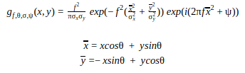
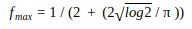
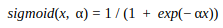
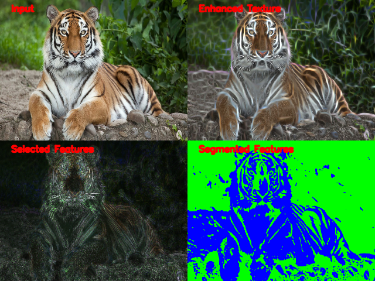
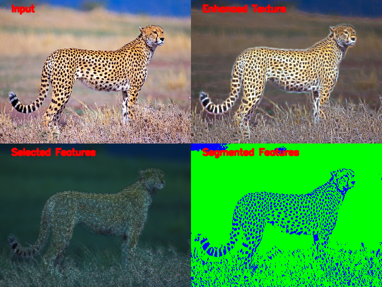
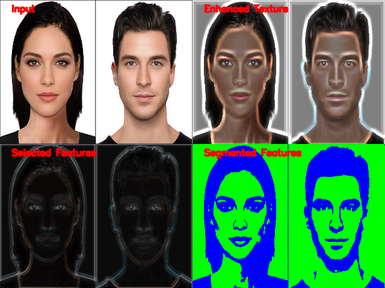
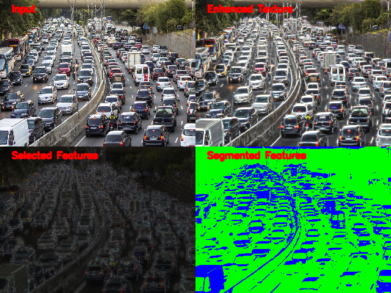

# Texture Enhancer and Unsupervised Feature Segmenter using optimal Gabor filter bank

## Algorithm Description
This project includes implementation of a texture enhancer and feature segmenter using optimized multiscale Gabor filters. Below are the components:
1)  Gabor filter bank generation and Image Decomposition
2)  Texture Enhancer
3)  Optimal feature selection with PCA 
4)  Feature Extraction and Binary Clustering

### 1) Gabor filter bank generation and Image Decomposition

The filter bank consists of 40 (5 frequency and 8 orientation) 2D Gabor kernels. This initial filter bank is used for texture enhancement. Gabor filters at the core are basically band pass filters with guassian kernels modulated by a sinusoidal wave with desired frequency and orientation. Hence they are best suited for multiscale feature extraction. Below is the gabor filter in the spatial domain:

<p align="center">
  
</p>

where f is the frequency of the sinusoidal wave, θ is the orientation, σ is the standard deviation of the gaussian kernel and ψ is the phase offset of the sinusoid wave. The maximum frequency of the bank is calculated as:

<p align="center">
  
</p>

### 2) Texture Enhancer
Here, the 40 filtered images obtained from image decomposition are merged into a single image using the max operator for each pixel. The 2 point norm can also be used for the merging of the pixels

### 3) Optimal feature selection with PCA
PCA is applied on the matrix of 40 feature vectors to find the orthonormal basis representation for the bank. N principal components are then selected such that 99% of the covariance is preserved. This is done separately for each of the RGB components. In order to display the selected features, a euclidean norm is applied on each pixel to combine the N vectors onto a single image. 

### 4)  Feature Extraction and Binary Clustering
The N feature matrix is passed through a energy function for feature extraction. Here, a non-linear sigmoidal function is used given by:

<p align="center">
  
</p>

This is followed by gaussian smoothing with σ equal to 4 times the gabor sigma used earlier. This filtered matrix is then normalized and passed to a k-means clustering algorithm with K=2 to separate the foreground features from the background. The blue pixels in the image are the foreground features and green is the background

## Getting Started
### Prerequisites
This project is built on Python 3. It requires OpenCV support and was tested with OpenCV-4.1.1. Although, versions 3.4.1 and above should work fine

### Running the program
```python3 src/main.py res/tiger.jpg```

## Demos
Below are the test results on a couple of random images. In the segmented image, blue represents the features and green represents background

<p align="center">
  
</p>

<p align="center">
  
</p>

<p align="center">
  
</p>

<p align="center">
  
</p>

## Author
Rodney Gracian Dsouza

## Reference
- Weitao Li, KeZhi Mao, Hong Zhang, Tianyou Chai, "Designing Compact Gabor Filter Banks for Efficient
Texture Feature Extraction"
- Anil K. Jain, Farshid Farrokhnia, "Unsupervised Texture Segmentation Using Gabor
Filters"

## Future Scope of Work
These segmented gabor features can be fed to classifiers for object categorization/recognition which is future scope of work
